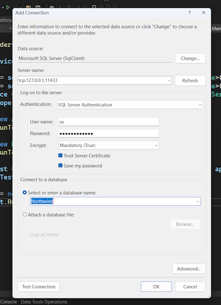

# Building an Entity Model for Northwind database

We will define an EF Core entity data model for a Northwind database stored in SQL Server.

## Northwind4AzureSqlEdgeDocker.sql script

We will use SQL Server on a local computer in Docker. This script creates the Northwind database. It does not drop it if it already exists because the Docker container should be empty anyway as a fresh one will be spun up each time. 

## Azure SQL Edge in a local Docker container

Network address

```bash
    tcp:127.0.0.1,11433
```

**Note:** I added an extra **1** to the port number so that the instance of Sql Server doesn't conflict with my local instance of Sql Server.

### Encrypting communication

If you get the error, *The certificate chain was issued by an authority that is not trusted*., then it is because the connection to the SQL Server database is trying to encrypt the transmission using the local development server certificate but the OS and therefore the app does not (yet) trust it.

You have three choices to fix this issue:

Add the following to the database connection string to make the local development server certificate trusted for this connection:

```bash
    TrustServerCertificate=true;
```

Add the following to the database connection string to disable encryption so it does not need to trust the certificate for this connection:

```bash
    Encrypt=false;
```

Run the following at the command prompt to trust the certificate for all .NET apps in future:

```bash
    dotnet dev-certs https --trust
```

### Setting up Sql Server to run in TCP/IP

In Sql Server configuration Manager select **Protocols for MSSQLSERVER**.

Double-click ``TCP/IP``, and in the ``TCP/IP`` Properties dialog box, set ``Enabled`` to **true** and click OK.

## Installing Docker and the Azure SQL Edge container image

You can install Docker on any operating system and use a container that has **Azure SQL Edge**, a cross-platform minimal featured version of SQL Server that only includes the database engine.

The Docker image we will use has Azure SQL Edge based on Ubuntu 18.4. It is supported with the Docker Engine 1.8 or later. Azure SQL Edge requires a 64-bit processor (either x64 or ARM64), with a minimum of one processor and 1 GB RAM on the host:

At the command prompt or terminal, pull down the latest container image for Azure SQL Edge, as shown in the following command:

```bash
    docker pull mcr.microsoft.com/azure-sql-edge:latest
```

### Run the Azure SQL Edge container image

Now we can run the image:

At the command prompt or terminal, run the container image for Azure SQL Edge with a strong password and name the container azuresqledge, as shown in the following command:

```bash
docker run --cap-add SYS_PTRACE -e 'ACCEPT_EULA=1' -e 'MSSQL_SA_PASSWORD=mypassword123' -p 11433:1433 --name azuresqledge -d mcr.microsoft.com/azure-sql-edge
```

### Connecting to Azure SQL Edge in a Docker container

Use your preferred database tool to connect to Azure SQL Edge in the Docker container. Some common database tools are shown in the following list:

**Windows only:**

**SQL Server Management Studio (SSMS)**: The most popular and comprehensive tool for managing SQL Server databases. Free to download from Microsoft.

**SQL Server Data Tools (SSDT)**: Integrated into Visual Studio and free to use, SSDT provides database development tools for designing, deploying, and managing SQL Server databases.

Cross-platform for Windows, macOS, Linux:

**VS Code's MS SQL extension**: Query execution, IntelliSense, database browsing, and connection to SQL Server databases.

**Azure Data Studio**: A cross-platform database management tool focused on query editing, data insights, and lightweight management.

### Some notes about the database connection string for SQL Edge

**Data Source**, a.k.a. server: tcp:127.0.0.1,11433

You must use **SQL Server Authentication**, a.k.a. **SQL Login**. That is, you must supply a username and password. Azure SQL Edge image has the sa user already created and you had to give it a strong password when you ran the container. 

You must select the **Trust Server Certificate** check box.

**Initial Catalog**, a.k.a. database: master or leave blank.

## Connection to Visual Studio

From the **Server Explorer** tab on the left-hand side of Visual Studio we can create a database connection.



## Creating the Northwind database using a SQL script

Now you can use your preferred code editor (or database tool) to execute the SQL script to create the Northwind database in SQL Edge:

Open the Northwind4AzureSQLEdgeDocker.sql file.

Execute the SQL script:

If you are using Visual Studio, right-click in the script, then select Execute, and then wait to see the Command completed successfully message.

If you are using VS Code, right-click in the script, select Execute Query, select the Azure SQL Edge in Docker connection profile, and then wait to see the Commands completed successfully messages.

Refresh the database tab and you should be able to see the database in your Sql Server instance.

**Note:** the data is added to your container. If you stop the container it won't be available. You can restart your container to get access to the Northwind database. If you remove the container you will loose the data in the container so then you will have to reinstall the database in a new container.

## Creating a docker-compose.yml file

Running the container from above is a bit tedious so I have created a ``docker-compose.yml`` file.

```bash
    docker compose --build
```

Then.

```bash
    docker compose up
```

## Central Package Management

By default, with the .NET SDK CLI and most code editor-created projects, if you need to reference a ``NuGet`` package, you add the reference to the package name and version directly in the project file.

**Central Package Management (CPM)** is a feature that simplifies the management of NuGet package versions across multiple projects within a solution. This is particularly useful for large solutions with many projects, where managing package versions individually can become cumbersome and error-prone.

The key features and benefits of CPM include:

1. **Centralised Control**: CPM allows you to define package versions in a single file, typically Directory.Packages.props, which is placed in the root directory of your solution. This file centralises the version information for all NuGet packages used across the projects in your solution.
2. **Consistency**: Ensures consistent package versions across multiple projects. By having a single source of truth for package versions, it eliminates discrepancies that can occur when different projects specify different versions of the same package.
3. **Simplified Updates**: Updating a package version in a large solution becomes straightforward. You update the version in the central file, and all projects referencing that package automatically use the updated version. This significantly reduces the maintenance overhead.
4. **Reduced Redundancy**: Removes the need to specify package versions in individual project files (.csproj). This makes project files cleaner and easier to manage, as they no longer contain repetitive version information.

**Note:** create the following file structure.

> web-dev-net9

Under this.

> MatureWeb

In this folder create the file ``Directory.Packages.props``.

See the completed file in **\Project-Examples\asp.net\web-dev-net9\MatureWeb**.

**Warning!** The ``<ManagePackageVersionsCentrally>`` element and its true value must go all on **one line**. Also, you cannot use floating wildcard version numbers like 9.0-* as you can in an individual project. Wildcards are useful to automatically get the latest patch version, for example, monthly package updates on Patch Tuesday. But with CPM you must
manually update the versions.

For any projects that we add underneath the folder containing this file, we can reference the packages without explicitly specifying the version, as shown in the following markup:

```bash
<ItemGroup>
    <PackageReference Include="Microsoft.EntityFrameworkCore.SqlServer" />
    <PackageReference Include="Microsoft.EntityFrameworkCore.Design" />
</ItemGroup>
```

**Note:** you should regularly review and update the package versions in the Directory.Packages.props file to ensure that you are using the latest stable releases with important bug fixes and performance improvements.

## Setting up the EF Core CLI tool

The .NET CLI tool named dotnet can be extended with capabilities useful for working with EF Core. It can perform design-time tasks like creating and applying migrations from an older model to a newer model and generating code for a model from an existing database.

The **dotnet-ef command-line tool** is not automatically installed. You must install this package as either a global or local tool. If you have already installed an older version of the tool, then you should update it to the latest version:

First, list what you have installed with.

```bash
    dotnet tool list --global
```

If it isn't installed then.

```bash
    dotnet tool install --global dotnet-ef
```

If it is installed then do an upgrade.

```bash
    dotnet tool update --global dotnet-ef
```

If necessary, follow any OS-specific instructions to add the dotnet tools directory to your PATH environment variable, as described in the output of installing the dotnet-ef tool. On my PC.

> C:\Program Files\dotnet

## Creating a class library for entity models

You will now define entity data models in a class library so that they can be reused in other types of projects, including client-side app models.

**Good Practice**: You should create a separate class library project for your entity data models from the class library for your data context. This allows easier sharing of the entity models between backend web servers and frontend desktop, mobile, and Blazor clients, while only the backend needs to reference the data context class library.

We will automatically generate some entity models using the EF Core command-line tool:

Use your preferred code editor to create a new project and solution, as defined in the following list:

**Project template**: Class Library / classlib

**Project file and folder**: Northwind.EntityModels

**Solution file and folder**: MatureWeb

Install these packages by adding the following into your ``.csproj`` file.

```bash
<ItemGroup>
	<PackageReference Include="Microsoft.EntityFrameworkCore.SqlServer" />
	<PackageReference Include="Microsoft.EntityFrameworkCore.Design">
		<PrivateAssets>all</PrivateAssets>
		<IncludeAssets>
			runtime; build; native; contentfiles; analyzers;
			buildtransitive
		</IncludeAssets>
	</PackageReference>
</ItemGroup>
```

**Note:** as we said before don't add version numbers to the packages as they are selected in ``Directory.Packages.props``.

Build the project to restore the packages.

You will now define entity data models in a class library so that they can be reused in other types of projects, including client-side app models.

**Note:** make sure that the SQL Edge container is running because you are about to connect to the server and its Northwind database.

At a command prompt or terminal, in the Northwind.EntityModels project folder (the folder that contains the .csproj project file), generate entity class models for all tables, as shown in the following command:

```bash
dotnet ef dbcontext scaffold "Data Source=tcp:127.0.0.1,11433;Initial Catalog=Northwind;User Id=sa;Password=yourpassword;TrustServerCertificate=true;" Microsoft.EntityFrameworkCore.SqlServer --namespace Northwind.EntityModels --data-annotations
```

You should now see your Entity models in the ``Northwind.EntityModels`` library.

**Note:** I will use this in future to get a set of Entity Models for an existing database.

## Creating a class library for a database context

You will now define a database context class library:

1. Add a new project to the solution, as defined in the following list:

**Project template**: Class Library /classlib

**Project file and folder**: Northwind.DataContext

**Solution file and folder**: MatureWeb

In the **Northwind.DataContext** project, statically and globally import the Console class, add a package reference to the EF Core data provider for SQL Server, and add a project reference to the Northwind.EntityModels project, as shown in the following markup:

```bash
    Install-Package Microsoft.EntityFrameworkCore.SqlServer
```

Another way to install the package is to manually build the ``.csproj`` file yourself. For example I could have done this.

```bash
<Project Sdk="Microsoft.NET.Sdk">

  <PropertyGroup>
    <TargetFramework>net9.0</TargetFramework>
    <ImplicitUsings>enable</ImplicitUsings>
    <Nullable>enable</Nullable>
  </PropertyGroup>
    <ItemGroup Label="To simplify use of WriteLine.">
    	<Using Include="System.Console" Static="true" />
    </ItemGroup>
    <ItemGroup>
      <PackageReference Include="Microsoft.EntityFrameworkCore.SqlServer" Version="9.0.0" />
    </ItemGroup>
	<ItemGroup>
	<ProjectReference Include="..\Northwind.EntityModels\Northwind.EntityModels.csproj" />
	</ItemGroup>
</Project>
```

I would then build the project and it would install the SqlServer packages and added the project reference.

In the Northwind.DataContext project, add a class named ``NorthwindContextLogger.cs``.

Modify its contents to define a static method named ``WriteLine`` that appends a string to the end of a text file named ``northwindlog-<date_time>.txt`` on the desktop, as shown in the following code:

```bash
    public static void WriteLine(string message)
    {
        string folder = Path.Combine(GetFolderPath(SpecialFolder.MyDocuments), "book-logs");
    
        if (!Directory.Exists(folder))
        {
            Directory.CreateDirectory(folder);
        }
    
        string dateTimeStamp = DateTime.Now.ToString("yyyyMMdd_HHmmss");
        string path = Path.Combine(folder, $"northwindlog-{dateTimeStamp}.txt");
        StreamWriter textFile = File.AppendText(path);
        textFile.WriteLine(message);
        textFile.Close();
    }
```

**Important:** now shift the ``NorthwindContext.cs`` from the ``Northwind.EntityModels`` project to the ``Northwind.DataContext`` project.

In the ``Northwind.DataContext`` project, add a class named ``NorthwindContextExtensions.cs``. Modify its contents to define an extension method that adds the Northwind database context to a collection of dependency services, as shown in the following code:

```bash
    public static  class NorthwindContextExtensions
    {
        /// <summary>
        /// Adds NorthwindContext to the specified IServiceCollection. Uses the SqlServer database provider.
        /// </summary>
        /// <param name="services">The service collection.</param>
        /// <param name="connectionString">Set to override the default.</param>
        /// <returns>An IServiceCollection that can be used to add more services.</returns>
        public static IServiceCollection AddNorthwindContext(this IServiceCollection services, string? connectionString = null)
        {
            if (connectionString is null)
            {
                SqlConnectionStringBuilder builder = new();
                builder.DataSource = "tcp:127.0.0.1,1433"; // SQL Edge in Docker.
                builder.InitialCatalog = "Northwind";
                builder.TrustServerCertificate = true;
                builder.MultipleActiveResultSets = true;
                // Because we want to fail faster. Default is 15 seconds.
                builder.ConnectTimeout = 3;

                // SQL Server authentication.
                builder.UserID = Environment.GetEnvironmentVariable("MY_SQL_USR");
                builder.Password = Environment.GetEnvironmentVariable("MY_SQL_PWD");
                connectionString = builder.ConnectionString;
            }

            services.AddDbContext<NorthwindContext>(options =>
            {
                options.UseSqlServer(connectionString);
                options.LogTo(NorthwindContextLogger.WriteLine,
                new[] { Microsoft.EntityFrameworkCore.Diagnostics.RelationalEventId.CommandExecuting });
            },

            // Register with a transient lifetime to avoid concurrency
            // issues with Blazor Server projects.
            contextLifetime: ServiceLifetime.Transient,
            optionsLifetime: ServiceLifetime.Transient);

            return services;
        }
    }
```

## Setting the user and password for SQL Server authentication

If you are using SQL Server authentication, i.e., you must supply a user and password, then complete the following steps:

In the Northwind.DataContext project, note the statements that set UserId and Password, as shown in the following code:

```bash
    // SQL Server authentication.
    builder.UserId = Environment.GetEnvironmentVariable("MY_SQL_USR");
    builder.Password = Environment.GetEnvironmentVariable("MY_SQL_PWD");.
```

Set the two environment variables at the command prompt or terminal, as shown in the following commands:

**On Windows:**

```bash
    setx MY_SQL_USR sa
    setx MY_SQL_PWD mypassword123
```

**On macOS and Linux:**

```bash
    export MY_SQL_USR=sa
    export MY_SQL_PWD=mypassword123
```

**Important Note:** You will need to restart any command prompts, terminal windows, and applications like Visual Studio for this change to take effect. 

I had an old password set for ``MY_SQL_PWD`` and if you run the command, ``set`` it will show you all your environment variables. The problem was I reset the variable and it was still showing the old password in the Terminal window and Visual Studio. Onve I closed bot of these applications and restarted them it showed the changed variable.

**Good Practice:**  Although you could define the two environment variables in the ``launchSettings.json`` file of an ASP.NET Core project, you must then be extremely careful not to include that file in a GitHub repository! Add the ``launchSettings.json`` into your ``.gitignore`` file.

## Registering dependency services

You can register dependency services with different lifetimes, as shown in the following list:

* **Transient**: These services are created each time they're requested. Transient services should be lightweight and stateless.
* **Scoped**: These services are created once per client request and are disposed of, then the response returns to the client.
* **Singleton**: These services are usually created the first time they are requested and then shared, although you can provide an instance at the time of registration too.

Introduced in .NET 8 is the ability to set a key for a dependency service. This allows multiple services to be registered with different keys and then retrieved later using that key:

```bash
    builder.Services.AddKeyedsingleton<IMemoryCache, BigCache>("big");
    builder.Services.AddKeyedSingleton<IMemoryCache, SmallCache>("small");
    class BigCacheConsumer([FromKeyedServices("big")] IMemoryCache cache)
    {
        public object? GetData() => cache.Get("data");
    }
    class SmallCacheConsumer(IKeyedServiceProvider keyedServiceProvider)
    {
        public object? GetData() => keyedServiceProvider.GetRequiredKeyedService<IMemoryCache>("small");
    }
```

You will use all three types of lifetime but we will not need to use keyed services.

By default, a DbContext class is registered using the Scope lifetime, meaning that multiple threads can share the same instance. But DbContext does not support multiple threads. If more than one thread attempts to use the same NorthwindContext class instance at the same time, then you will see the following runtime exception thrown: A second operation started on this context before a previous operation completed. This is usually caused by different threads using the same instance of a DbContext. However, instance members are not guaranteed to be thread-safe.

This happens in Blazor projects with components set to run on the server side because, whenever interactions on the client side happen, a SignalR call is made back to the server where a single instance of the database context is shared between multiple clients. This issue does not occur if a component is set to run on the client side.

## Improving the class-to-table mapping

We will make some small changes to improve the entity model mapping and validation rules for SQL Server.

We will add a regular expression to validate that a CustomerId value is exactly five uppercase letters:

1. In ``Customer.cs``, add a regular expression to validate its primary key CustomerId to only allow uppercase Western characters, as shown highlighted in the following code:

```bash
    [Key]
    [StringLength(5)]
    [RegularExpression("[A-Z]{5}")]
    public string CustomerId { get; set; } = null!;
```

2. In ``Customer.cs``, add the [``Phone``] attribute to its Phone property, as shown highlighted in the following code:

```bash
    [StringLength(24)]
    [Phone]
    public string? Phone { get; set; }
```

The [``Phone``] attribute adds the following to the rendered HTML: type="tel". On a mobile phone, this makes the keyboard use the phone dialer instead of the normal keyboard.

3. In ``Order.cs``, decorate the CustomerId property with the same regular expression to enforce five uppercase characters.

## Testing the class libraries using xUnit

let's build some unit tests to ensure the class libraries are working correctly.

Let's write the tests:

1. Use your preferred coding tool to add a new **xUnit Test Project [C#]** / xunit project named **Northwind.UnitTests** to the MatureWeb solution.

2. In the **Northwind.UnitTests** project, delete the version numbers specified for the testing packages in the project file. (Visual Studio and other code editors will give errors if you have projects that should use CPM but specify their own package versions without using the VersionOverride attribute.)

3.
In the Northwind.UnitTests project, add a project reference to the ``Northwind.DataContext`` project, as shown in the following configuration:

```bash
<ItemGroup>
<PackageReference Include="coverlet.collector" />
<PackageReference Include="Microsoft.NET.Test.Sdk" />
<PackageReference Include="xunit" />
<PackageReference Include="xunit.runner.visualstudio" />
</ItemGroup>
<ItemGroup>
<ProjectReference Include="..\Northwind.DataContext\Northwind.DataContext.csproj" />
</ItemGroup>
```

4. Build the ``Northwind.UnitTests`` project to build referenced projects.

5. Rename ``UnitTest1.cs`` to ``EntityModelTests.cs``.

6. Modify the contents of the file to define two tests, the first to connect to the database and the second to confirm there are eight categories in the database, as shown in the following code:

```bash
    public class EntityModelTests
    {
        [Fact]
        public void DatabaseConnectTest()
        {
            using NorthwindContext db = new();
            Assert.True(db.Database.CanConnect());
        }

        [Fact]
        public void CategoryCountTest()
        {
            using NorthwindContext db = new();
            int expected = 8;
            int actual = db.Categories.Count();
            Assert.Equal(expected, actual);
        }

        [Fact]
        public void ProductId1IsChaiTest()
        {
            using NorthwindContext db = new();
            string expected = "Chai";
            Product? product = db.Products.Find(keyValues: 1);
            string actual = product?.ProductName ?? string.Empty;
            Assert.Equal(expected, actual);
        }
    }
```

7. Run the unit tests:

If you are using Visual Studio, then navigate to **Test | Run All Tests**, and then view the results in **Test Explorer**.

If you are using VS Code, then in the ``Northwind.UnitTests`` project's TERMINAL window, run the tests, as shown in the following command: **dotnet test**. Alternatively, use the TESTING window if you have installed C# Dev Kit.

8. Note that the results should indicate that three tests ran, and all passed.
