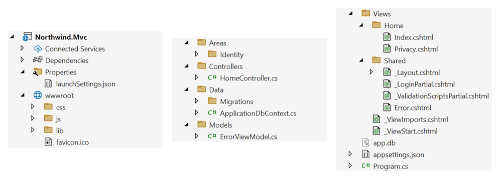
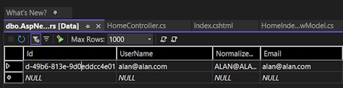

# Building Websites Using ASP.NET Core MVC

## Setting up an ASP.NET Core MVC website

The MVC design pattern is useful for complex websites, where a formal structure is needed to manage that complexity. ASP.NET Core MVC uses technologies like Razor syntax, but allows a cleaner separation of responsibilities, sometimes called technical concerns, as shown in the following list:

* **Models**: Classes that represent the data entities and view models used on the website.
* **Views**: Razor Views are .cshtml files that render data in view models into HTML for a dynamically-generated web page.
* **Controllers**: Classes that execute code when an HTTP request arrives at the web server. The controller methods usually instantiate a view model and pass that to a view in order to generate an HTTP response. This is returned to the web browser or other client that made the original request.

**Warning:** When creating a Razor Views, you must not use the ``@page`` directive at the top of the file! If you do, then you have created a Razor Page and this behaves differently. For example, the controller will not pass the model and it will be null, throwing a ``NullReferenceException`` when you try to access any of its members.

Let’s review a simplified diagram to understand how these components work together to process an incoming HTTP ``request`` and send back an outgoing HTTP ``response``.


The HTTP request is processed in the following four steps:

**Route:** In Program.cs, there is a block of statements that configures the HTTP pipeline. A default route is configured so that if no relative path is specified, it assumes a controller name of **Home** (with a class name of ``HomeController``) and an action method name of ``Index``. If a relative path is specified, for example, ``/Products/Detail/3``, then the controller name would be **Products** (with a class name of ``ProductsController``), an action method name of ``Details``, and an ``id`` parameter value of 3.

**Controller:** In ``<controller>Controller.cs``, the controller class is instantiated and the action method is called. If the method has parameters, they are set automatically from parameters in the **HTTP request**. These can come from the route path, query string, and any posted ``<form>`` element or uploaded file.

**Model:** The action method constructs an instance of the appropriate model and passes it to a view. The controller returns the rendered view to the HTTP pipeline as a response including a status code like ``200 OK`` or ``400 Bad Request``.

**View:** The appropriate view renders the model into a response format, typically HTML, but could be anything, like an image, PDF, JSON, or XML.

**Info:** The MVC design pattern as implemented in ASP.NET Core MVC might have been better named **Route-Controller-Model-View** (RCMV) to match the order of the components that are used in the process. But MVC sounds better.

The best way to understand using the MVC design pattern is to see a working example.

## Creating an ASP.NET Core MVC website

You will use a project template to create an ASP.NET Core MVC website project that has a database for authenticating and authorizing users using individual accounts. A visitor to the website can register their email, set a password, and then log in to the website using those credentials.

Visual Studio defaults to using SQL Server LocalDB for the accounts database. VS Code (or more accurately, the dotnet CLI tool) uses SQLite by default and you can specify a switch to use SQL Server LocalDB instead.

Let’s see it in action:

Use your preferred code editor to open the **MatureWeb** solution.

Add an MVC website project with authentication accounts stored in a local database, as defined in the following list:

**Project template:** ASP.NET Core Web App (Model-View-Controller) [C#] / mvc

**Project file and folder:** Northwind.Mvc

**Solution file and folder:** MatureWeb

**Framework:** .NET 9.0

**Authentication type:** Individual Accounts / --auth Individual

**Configure for HTTPS:** Selected
*Enable container support:* Cleared

In the ``Northwind.Mvc.csproj`` project file, remove the **Version attributes** in ``<PackageReference>`` elements because they are set in the solution-level ``Directory.Packages.props`` file.

Add an element to import the ``System.Console`` class globally and statically.

If you are using Visual Studio, in Solution Explorer, toggle Show All Files. 

Expand the obj folder, expand the Debug folder, expand the net9.0 folder, select the ``Northwind.Mvc.GlobalUsings.g.cs`` file, and note how the implicitly imported namespaces include all the ones for a console app or class library, as well as some ASP.NET Core ones, such as ``Microsoft.AspNetCore.Builder``, as shown in the following code:

```bash
// <autogenerated />
global using global::Microsoft.AspNetCore.Builder;
global using global::Microsoft.AspNetCore.Hosting;
global using global::Microsoft.AspNetCore.Http;
global using global::Microsoft.AspNetCore.Routing;
global using global::Microsoft.Extensions.Configuration;
global using global::Microsoft.Extensions.DependencyInjection;
global using global::Microsoft.Extensions.Hosting;
global using global::Microsoft.Extensions.Logging;
global using global::System;
global using global::System.Collections.Generic;
global using global::System.IO;
global using global::System.Linq;
global using global::System.Net.Http;
global using global::System.Net.Http.Json;
global using global::System.Threading;
global using global::System.Threading.Tasks;
global using static global::System.Console;
```

Build the Northwind.Mvc project.

At the command prompt or terminal, use the help switch to see other options for this project template, as shown in the following command:

```bash
    dotnet new mvc --help
```

Note the results, as shown in the following partial output:

> ASP.NET Core Web App (Model-View-Controller) (C#)     
> Author: Microsoft     
> Description: A project template for creating an ASP.NET Core application with example ASP.NET Core MVC Views and > Controllers. This template can also be used for RESTful HTTP services.


### Creating the authentication database for SQL Server LocalDB

If you created the MVC project using Visual Studio, or you used dotnet new mvc with the -uld or --use-local-db switch, then the database for authentication and authorization will be stored in SQL Server LocalDB. But the database itself does not exist yet.

If you created the MVC project using dotnet new or Rider, then the database for authentication and authorization will be stored in SQLite and the file has already been created, named app.db.

The connection string for the authentication database is named ``DefaultConnection`` and it is stored in the ``appsettings.json`` file in the root folder for the MVC website project.

For SQLite, see the following setting:

```BASH
    {
        "ConnectionStrings": {
            "DefaultConnection": "DataSource=app.db;Cache=Shared"
    },
```

If you created the MVC project using Visual Studio, then let’s create its authentication database now by following a few simple steps:

In the ``Northwind.Mvc`` project, in ``appsettings.json``, note the database connection string named ``DefaultConnection``, as shown highlighted in the following configuration:

```bash
{
  "ConnectionStrings": {
    "DefaultConnection": "Server=(localdb)\\mssqllocaldb;Database=aspnet-Northwind.Mvc-440bc3c1-f7e7-4463-99d5-896b6a6500e0;Trusted_Connection=True;MultipleActiveResultSets=true"
  },
  "Logging": {
    "LogLevel": {
      "Default": "Information",
      "Microsoft.AspNetCore": "Warning"
    }
  },
  "AllowedHosts": "*"
}
```

Your database name will use the pattern ``aspnet-[ProjectName]-[GUID]`` and have a different GUID value from the example above.

At a command prompt or terminal, in the ``Northwind.Mvc`` folder, enter the command to run database migrations so that the database used to store credentials for authentication is created, as shown in the following command:
dotnet ef database update

```bash
    dotnet ef database update
```

Note the database is created with tables like ``AspNetRoles``.

If you get an error because SQL Server LocalDB is not installed, you can install it manually using the instructions at the following link: [Microsoft SQL Server localdb](https://learn.microsoft.com/en-us/sql/database-engine/configure-windows/sql-server-express-localdb).

### Changing the port numbers and starting the website

By default, the project template assigns random port numbers to host the website. The port numbers could conflict with other port numbers used on your computer, so it is good practice to manually set them.

Let’s review the behavior of the default ASP.NET Core MVC website project template:

In the ``Northwind.Mvc`` project, expand the ``Properties`` folder and open the file named ``launchSettings.json``, and note the profiles named **http** and **https**. They have randomly assigned port numbers that you will change.

The ``launchSettings.json`` file is only for use during development. It has no effect on the build process. It is not deployed with the compiled website project, so it has no effect on the production runtime. It is only processed by code editors like Visual Studio to set up environment variables and define URLs for the web server to listen on when the project is started by a code editor. 

In ``launchSettings.json``, change the configured port numbers for the ``https`` profile.

```bash
"applicationUrl": "https://localhost:5021;http://localhost:5020",
```

**Note:** the order of URLs in this setting is important. The first URL will be used by default, and the second only used as a fallback.

Start the Northwind.Mvc website using the https launch profile:

If you are using Visual Studio, in the toolbar, select the https profile, select Google Chrome as the Web Browser, and then start the project without debugging.

## Reviewing an MVC website project structure

In your code editor, in Visual Studio **Solution Explorer** (toggle on **Show All Files**) hover your mouse in the **Solution** pane, click the eyeball icon, and then review the structure of an MVC website project. We will look in more detail at some of these parts later.



``Properties``: This folder contains a configuration file for Internet Information Services (IIS) or IIS Express on Windows and for launching the website during development named ``launchSettings.json``. This file is only used on the local development machine and is not deployed to your production website.

``wwwroot``: This folder contains static content used by the website. For example, you should put images and other static file resources like PDF documents here or in a subfolder.

* ``css``: This folder contains a stylesheet for the website project.
* ``js``: This folder contains a JavaScript file for the website project.
* ``lib``: This folder contains client-side libraries like Bootstrap and jQuery.
* ``favicon.ico``: This file is shown on tabs by browsers.

``Areas``: This folder contains nested folders and a file needed to integrate your website project with **ASP.NET Core Identity**, which is used for authentication.

``Controllers``: This folder contains C# classes that have methods (known as actions) that fetch a model and pass it to a view, for example, ``HomeController.cs``.

``Data``: This folder contains Entity Framework Core (EF Core) migration classes used by the ASP.NET Core Identity system to provide data storage for authentication and authorization, for example, ``ApplicationDbContext.cs``.

``Models``: This folder contains C# classes that represent all of the data gathered together by a controller and passed to a view, for example, ``ErrorViewModel.cs``.

``Views``: This folder contains the ``.cshtml`` Razor files that combine HTML and C# code to dynamically generate HTML responses:

* ``Home``: This subfolder contains Razor files for the home and privacy pages.
* ``Shared``: This subfolder contains Razor files for the shared layout, an error page, and two partial views for logging in and * validation scripts.
* ``_ViewImports``: This file imports common namespaces used in all views like Tag Helpers.
* ``_ViewStart``: This file sets the default layout.

``app.db``: This is the ``SQLite`` database that stores registered visitors. (If you used SQL Server LocalDB, then it will not be needed).

``appsettings.json`` and ``appsettings.Development.json``: These files contain settings that your website can load at runtime, for example, the database connection string for the ASP.NET Core Identity system and logging levels. These settings can be overridden by other mechanisms like environment variables, application secrets, and command-line arguments. 

``Northwind.Mvc.csproj``: This file contains project settings like the use of the web .NET SDK, an entry for SQLite to ensure that the app.db file is copied to the website’s output folder, and a list of NuGet packages that your project requires, including EF Core and ASP.NET Core Identity packages. To edit it with Visual Studio, double-click the project name.

``Northwind.Mvc.csproj.user``: This file contains Visual Studio session settings for remembering options. For example, which launch profile was selected, like https. Visual Studio hides this file, and it should not normally be included in source code control because it is specific to an individual developer.

``Program.cs``: This file defines a hidden ``Program`` class that contains the ``<Main>$`` entry point. It builds a pipeline for processing incoming HTTP requests and hosts the website using default options like configuring the Kestrel web server and loading ``appsettings``. It adds and configures services that your website needs, for example, ASP.NET Core Identity for authentication, SQLite or SQL Server for identity data storage, and so on, and routes for your application.

## Reviewing the ASP.NET Core Identity database

When creating the ASP.NET Core MVC website project, if you choose to enable authentication using individual accounts, then you need a database to store the user accounts, including emails and passwords. This could be a local SQLite database file or a SQL Server database. By default, the SQL Server database will use SQL Server LocalDB as the database server, but you can configure the database connection string to use a remote or cloud SQL Server instead.

**Good Practice**: Most ASP.NET Core MVC projects need to connect to other databases too. For example, our project connects to the ``Northwind`` database. Although, by default, the tables needed by ASP.NET Core Identity are stored in their own database, you could add those tables to an existing database like Northwind. This could simplify deployments by having a single database for everything needed by the MVC project, instead of multiple separate databases.

Open ``appsettings.json`` to find the connection string used for the ASP.NET Core Identity database, as shown highlighted for SQL Server LocalDB in the following markup:

```bash
{
  "ConnectionStrings": {
    "DefaultConnection": "Server=(localdb)\\mssqllocaldb;Database=aspnet-Northwind.Mvc-2F6A1E12-F9CF-480C-987D-FEFB4827DE22;Trusted_Connection=True;MultipleActiveResultSets=true"
  },
  "Logging": {
    "LogLevel": {
      "Default": "Information",
      "Microsoft.AspNetCore": "Warning"
    }
  },
  "AllowedHosts": "*"
}
```

If you used SQL Server LocalDB for the identity data store, then you can use **Server Explorer** to connect to the database. You can copy and paste the connection string from the ``appsettings.json`` file. Remember to remove the second backslash between (``localdb``) and ``mssqllocaldb``.

> aspnet-Northwind.Mvc-de5b8d37-cc66-46b9-bfcd-82e878fc2634



## Configuring files included in an ASP.NET Core project

Until now, most of our projects have been simple console apps and class libraries with a few C# class files. By default, when we compiled those projects, all ``.cs`` files in the project folder or subfolders were automatically included in the build at compile time.

ASP.NET Core projects get more complicated. There are many more file types; some of them can be compiled at runtime instead of compile time, and some of them are just content that does not need to be compiled but does need to be deployed along with the compiled assemblies.

You can control how files are processed during a build, and which are included or excluded from a deployment, by putting elements in the project file. These are processed by **MS Build** and other tools during builds and deployments.

You declare items in the project file as child elements of an ``<ItemGroup>`` element. For example:

```bash
<--Include the greet.proto file in the build process.-->
<ItemGroup>
  <Protobuf Include="Protos\greet.proto" GrpcServices="Server" />
</ItemGroup>
<--Remove the stylecop.json file from the build process.-->
<ItemGroup>
  <None Remove="stylecop.json" />
</ItemGroup>
<--Include the stylecop.json file in the deployment.-->
<ItemGroup>
  <AdditionalFiles Include="stylecop.json" />
</ItemGroup>
```

You can have as many ``<ItemGroup>`` elements as you want, so it is good practice to use them to logically divide elements by type. They are merged automatically by build tools.

Usually, you manually add these elements when you know you need to use them, but unfortunately, Visual Studio and other code editors sometimes mess things up by trying to be helpful.

For example, you might have added a new Razor Page file in the ``Pages`` folder named ``index.cshtml``. You start the web server, but the page does not appear. Or, you are working on a ``GraphQL`` service, and you add a file named ``seafoodProducts.graphql``. But when you run the GraphQL tool to auto-generate client-side proxies, it fails.

These are both common indications that your code editor has decided that the new file should not be part of the project. It has automatically added an element to the project file to remove the file from the build process without telling you.

To solve this type of problem, review the project file for unexpected entries, like the following, and delete them:

```bash
  <ItemGroup>
    <Content Remove="Pages\index.cshtml" />
  </ItemGroup>
  <ItemGroup>
    <GraphQL Remove="seafoodProducts.graphql" />
  </ItemGroup>
```

**Good Practice**: When using tools that automatically “fix” problems without telling you, review your project file for unexpected elements when unexpected results happen.

**More information**: You can read more about managing MS Build items at the following link: [MS Build documentation](https://learn.microsoft.com/en-us/visualstudio/msbuild/msbuild-items).

## Exploring an ASP.NET Core MVC website

### ASP.NET Core MVC initialization

Appropriately enough, we will start by exploring the MVC website’s default initialization and configuration:

**1.** In ``Program.cs``, note that it can be divided into four important sections from top to bottom. As you review the sections, you might want to add regions and comments to remind yourself of what each section is used for.

**2.** The first section imports some namespaces, as shown in the following code.

```bash
  using Microsoft.AspNetCore.Identity; // To use IdentityUser.
  using Microsoft.EntityFrameworkCore; // To use UseSqlServer method.
  using Northwind.Mvc.Data; // To use ApplicationDbContext.
```

Remember that, by default, many other namespaces are imported using the implicit usings feature of .NET 6 and later. Build the project and then the globally imported namespaces can be found in the following file: ``obj\Debug\net9.0\Northwind.Mvc.GlobalUsings.g.cs``.

**3.** The second section creates and configures a web host builder that does the following:

* It registers an application database context using SQL Server or SQLite. The database connection string is loaded from the  appsettings.json file.
* It adds ASP.NET Core Identity for authentication and configures it to use the application database.
* It adds support for MVC controllers with views, as shown in the following code:

```bash
  #region Configure the host web server including services.
  var builder = WebApplication.CreateBuilder(args);
  // Add services to the container.
  var connectionString = builder.Configuration
    .GetConnectionString("DefaultConnection") ??
      throw new InvalidOperationException("Connection string 'DefaultConnection' not found.");

  builder.Services.AddDbContext<ApplicationDbContext>(options => options.UseSqlServer(connectionString));

  builder.Services.AddDatabaseDeveloperPageExceptionFilter();

  builder.Services.AddDefaultIdentity<IdentityUser>(options => options.SignIn.RequireConfirmedAccount = true)
    .AddEntityFrameworkStores<ApplicationDbContext>();

  builder.Services.AddControllersWithViews();

  var app = builder.Build();
  #endregion
```

**4.** Note the builder object has two commonly used objects, Configuration and Services:

* ``Configuration`` contains merged values from all the places you could set configuration: ``appsettings.json``, environment variables, command-line arguments, and so on.
* ``Services`` is a collection of registered dependency services.

The call to ``AddDbContext`` is an example of registering a dependency service.ASP.NET Core implements the **dependency injection (DI)** design pattern so that other components like controllers can request needed services through their constructors. Developers register those services in this section of ``Program.cs``.

**5.** The third section configures the HTTP pipeline through which requests and responses flow in and out. It configures a relative URL path to run database migrations if the website runs in development, or a friendlier error page and **HTTP Strict Transport Security (HSTS)** for production. HTTPS redirection, static files, routing, and ASP.NET Identity are enabled, and an MVC default route and Razor Pages are configured, as shown in the following code:

```bash
#region Configure the HTTP request pipeline.
if (app.Environment.IsDevelopment())
{
  app.UseMigrationsEndPoint();
}
else
{
  app.UseExceptionHandler("/Home/Error");
  // The default HSTS value is 30 days. You may want to change this for production scenarios, see https://aka.ms/aspnetcore-hsts.
  app.UseHsts();
}

app.UseHttpsRedirection();
app.UseRouting();
app.UseAuthorization();
app.MapStaticAssets();

app.MapControllerRoute(
  name: "default",
  pattern: "{controller=Home}/{action=Index}/{id?}")
  .WithStaticAssets();

app.MapRazorPages()
  .WithStaticAssets();
#endregion
```

Note the following about the preceding code:

* The ``MapStaticAssets`` and ``WithStaticAssets`` methods were introduced with .NET 9. They compress static assets in the ``wwwroot`` folder and allow MVC and Razor Pages to reference the optimized assets.
* Arguably the most important method in this section of ``Program.cs`` is ``MapControllerRoute``, which maps a default route for use by MVC. This route is very flexible because it will map to almost any incoming URL, as you will see in the next topic.
* Although we will not create any Razor Pages in this book, we need to leave the method call that maps Razor Page support because our MVC website uses ASP.NET Core Identity for authentication and authorization, and that uses a Razor class library containing Razor Pages for its UI components, like visitor registration and login.
* The fourth and final section has a thread-blocking method call that runs the website and waits for incoming HTTP requests to respond to, as shown in the following code:

```bash
  #region Start the host web server listening for HTTP requests.
  app.Run(); // This is a blocking call.
  #endregion
```

### What does UseMigrationsEndPoint do?
